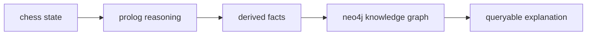
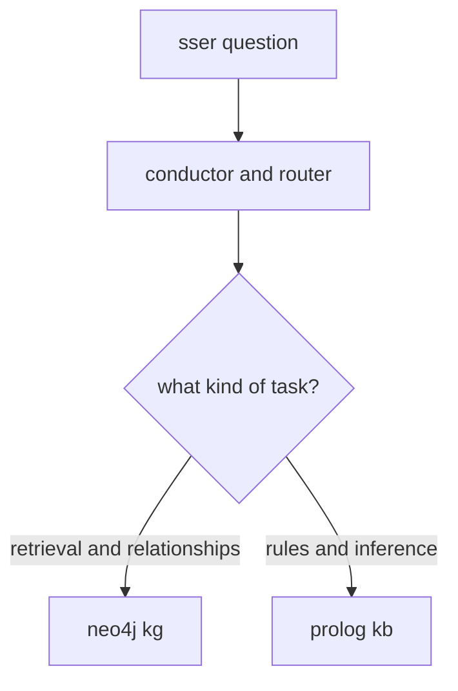

## caissa-ai

a multi-agent neurosymbolic system that delivers accurate chess commentary with almost no hallucinations.

### overview
we aim to provide **reasoning** and **understanding** of chess moves. by expressing chess concepts as a 
knowledge graph, and integrating this knowledge graph into the reponse generation workflow, we can empower the llm
to leverage credible chess concepts found within the knowledge graph to support it's responses.

what we are essentially building is a symbolic reasoning pipeline with knowledge graph explanation. retrieval is
only the last step. the knowledge is first generated or inferred symbolically in prolog, then represented as a
graph, and finally queried to explain a move.

f1. **example flow** - (example flow of what exaclty) 

### drafting

**goal:** we want to build a chess application that generates dynamic commentary for new moves, lets the user
ask questions, and generates reponses based on (1) what happened in the game, (2) verifiable chess concepts, and
(3) it's own pre-trained knowledge,

**first lets start with why I (cahree) am actually building this system and what i am expecting to gain
as an outcome:**
as a quick disclaimer, this system is not mine. it is an opensource project that I have chosen to clone and study.
i've chosen to study and re-develop this project to gain practical experience leveraging neuro-symbolic ai in
software systems. convenietly, this project combines chess (a passion of mine and something i have developement
experience with), neuro-symbolic ai, and modern ai engineering concepts, practices, and tools such as llm integration,
langraph, langchain, multiagent orchestration, knowledge graphs, rag, neo4j, backend dev with flask, reducing
llm halluciantion, and llm verifiability. My desired outcomes are to have demonstrable experience building real world
ai systems, gain a deep understanding of how neurosymbolic ai is actually used in real systems, learn the tradeoffs
of neurosymbolic solutions (pros and cons) / (benifits and limitations).

note: rememeber, the goal in studying neuro-symbolic ai is to build *better* ai systems. it almost doesnt matter
what you know, it matters what you do. same with software, what matters is what it can *do* for its users. the
approach itself means nothing for its own sake, what matters is what it provides, what are the benifits? how does
it provide something value?

#### functional requirements
1. fr-1: **the system shall generate commentary on the moves made throughout the game**. what does this mean: when
a move is made, the system shall process this move and generate commentary detailing chess concpets like a
tactic was found, or passed pawn created, or material gained, or gaining board space, or a blunder was made and why,
missed checkmate, etc.

2. fr-1.1: **the system shall infuse real chess concepts into it's reponses such as tactics, strategy, & theory**.

3. fr: **the system shall provide a chatbot interface**

4. fr: **the system shall enable chess game play**

#### non-functional requirments

#### high-level design

#### low-level design

#### developement plan
1. settings up environment / gathering resources
2. identifying knowledge & skill gaps and planning how i'll go about rectifying / dealing with them
3. s1: build and test chess engine service
4. s2: buid qa service, use mocks where needed

    note: instead of starting with the orchestrator, start with just 1 fixed pipeline that uses the knowledge graph or
    logic inference. mock these first to to set up skeleton

5. s3: build the knowledge graph

6. s4: build retrieval module

7. checkpoint: we should have a basic working commentary pipeline at the point
#### justification for developement plan

3. s1: ....

    s1.1: ...

    s1.2: ...

    s1.3: ...
    s1.4: ...
4. s2: ...
    s2.1: ...
    s2.2: ...
    ...
    ...
5. s3: ...
    s3.1: ...
    s3.2: ...
    ...
    ...

#### end-to-end system flow

#### questions

- **how is commentary actually generated for a move?**
suppose we're in the middle of a match and a user has just made a move, what gets sent to the backend service?
suppose we maintain some kind of state, representing the current gamestate, and the move just made, what we
want to do is generate commentary given this state, how can we formally describe this problem? 

    given:

        move-played: FEN
        state: GameState
        MovePost: """schema for a structured move post to send to backend services"""

        move_post = MovePost(move_played, state)

    process(move_post):

        """
        when a move post is sent to backend services, the following sequence of steps occur:

        1. QAService accepts post
            • the qa service calls the ResoonseService

        2. the Reponse Service calls the RouterAgent
            
            if no query, just move commentary:
                • nothing needs to be routed, just do the standard pipeline
                • standard pipeline: we generate commentary using the knowledge about the position
                as a some type of graph along with the llms input generation ( I guess ...?), maybe we
                just choose one (Neo4j kg) or (logic based) by default instead of routing
            if query sent:
                 • the router agent decides which capability ther current question requires
        3. Symbolic Module

            if query_given:
                this module either utilizes a logic knowledge base or knowledge graph in Neo4j to 
                execute queries.

            if no query_given, just commentary:
                well maybe we have an LLM generate a query? if no query is given, this means 
                we are just utilzing the **commentary feature** and what this feature is supposed
                to do is generate commentary for each move made throughout the game.

                what kind of commentary:
                - if some kind of tactic or blunder is made the commentary should be about that
                - commentary about captures made
                - commentray about positional changes (space, passed pawn, king danger).
                - so we must have acess to some kind of state that manages the game state but also 
                the core chess cocnepts in relationships about the game state that tells us things like
                key captures made, missed captures, space advantage, tactics, kind saftey, passed pawn, etc.

                from these core relationships extratced from the position, we rank them by importance maybe?
                and then generate commentary? this may be uneccessarily complex
                
                so we have specified the types of things the commentary is supposed to be about, how do we
                go about deciding what to look for within our knowledge bases though?

                do we maintain some sort of ranking or priority queue?

            • the symbolic module sends a SymbolicModuleReponse back to the orchestrator maybe and then
            the orchestrator sends SymbolicModuleResponse to the llm and the llm generates its reponses

            • the llm response is shown to the chat interface

#### interfaces and schemas

an interface defines how two entities communicate with one another. it's important to define interfaces because it reduces
uncertainty about behavior, expected inputs, and expected outputs. a schema is a type of interface, but it typically focuses
in datamodels so its primarily concerned and defining the structure of the datamodels

